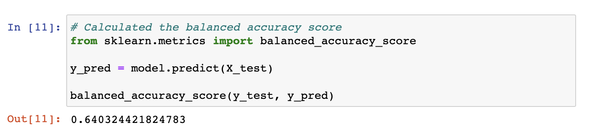
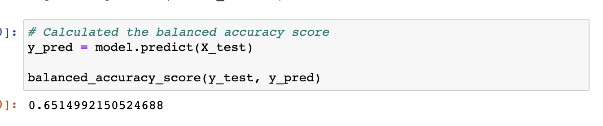
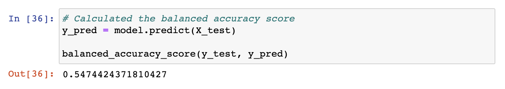
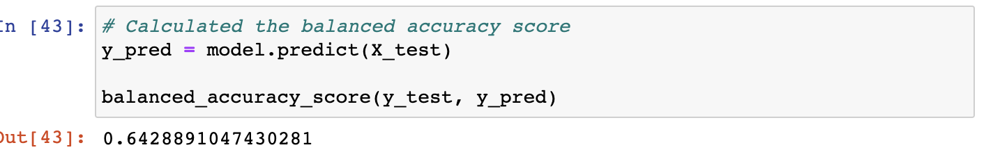
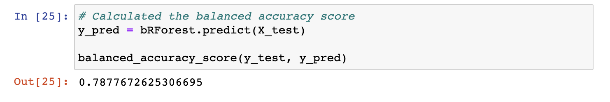
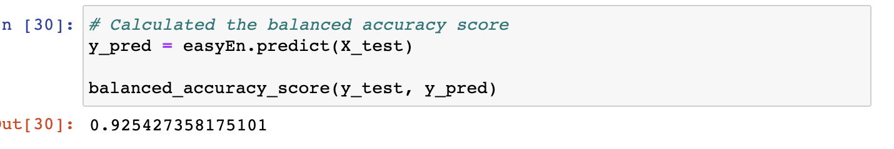

# Credit_Risk_Analysis
Machine Learning

## Overview of Credit Risk Analysis

### Backgound 
Credit risk is an inherently unbalanced classification problem, as good loans easily outnumber risky loans. Therefore, you’ll need to employ different techniques to train and evaluate models with unbalanced classes. Using the imbalanced-learn and scikit-learn libraries building and evaluating models using resmapling methods will help determine the best possible analysis method to reduce the risk of loss on loan returns. 

### Purpose 
The Purpose of this anlaysis is to use the resampling models to predict credit risk with imbalanced learn and scikit-learn libraries and evaluating which method provides the prediction with the least error. Combining and comapring methods are different ways of ensuring the best model is provided at the end. Finding the best predictor for the credit risk with the least error is the main purpose of this analaysis.

## Results

#### Using Resampling Models to Predict Credit Risk
- Naive Random Oversampling
    - The balanced accuracy score for naive oversampling does not prove to be accurate with a balanced accuracy score of about 64%. This 64% accuracy score proves to be insuffcient because it is not passing the typical 95% confidence interval that is required to consider accurate. 
    
    
- SMOTE Oversampling
  - The balanced accuracy score for SMOTE oversampling method does not prove to be accurate either with a score of about 65%.
  
  
- Undersampling
  - The balanced accuracy score for undersampling proved the method to also not be accurate with the score of about 54.74%.
  
  
- Combination - over and under sampling
  - The balanced accuracy score for combination sampling proved the method to be another inaccurate representation with an accuracy score of about 64.29% 
  

### Using Endemble Learners to determine best performance
- Balanced Random Forest Classifier
    - The balanced accuracy score for Balanced Random Forest proves to be more accurate than the other methods however, it still proves to be inaccurate with an accuracy score of about 78.78%
    
    
- Easy Ensemble AdaBoost Classifier
    - The balanved accuracy score for Easy Ensemble AdaBoost proves to be the most accurate model teste in this analaysis, however it still does not reach the 95% accuracy prediction requirement. 
    
 
 
## Summary

Through the resampling and esemble methods, when analyzing the different balanced accuracy scores, the conclusion that can be drawn is that none of the tested methods in this analysis are accurate enough to use in predicting credit risk. The reason for these methods not being accurate enough is typically, when using models there is a 95% confidence interval that must be met in order to condier the model accurate enough prediction methods. Since none of these models have a 95% accuracy rate or higher, they cannot be classified as accurate prediction models to use in real world applications. 
Further analysis needs to be conducted in order to find a prediction model that will work with predicting credit risk in order to reduce losses. 
